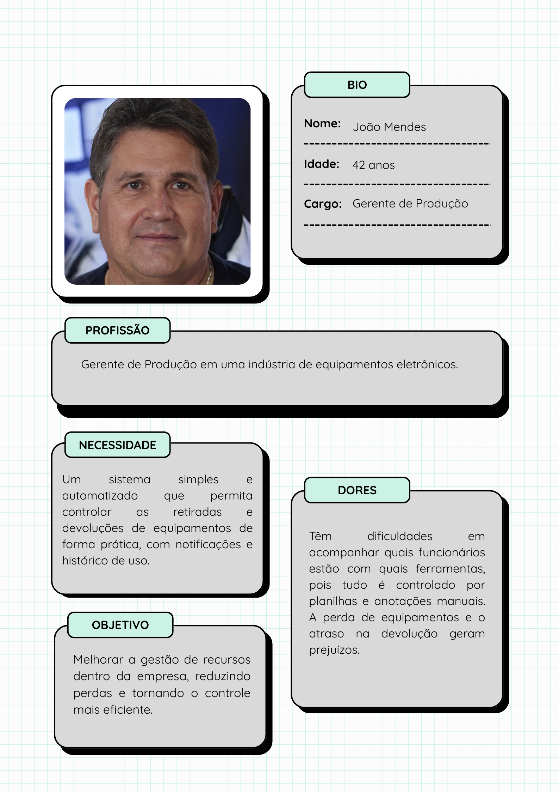
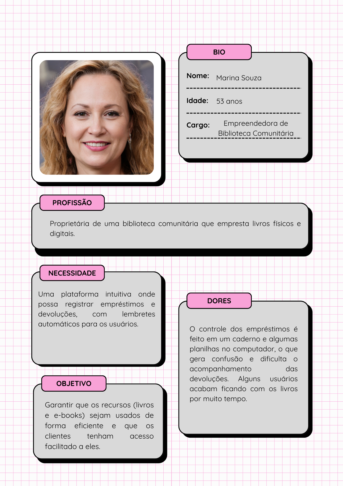
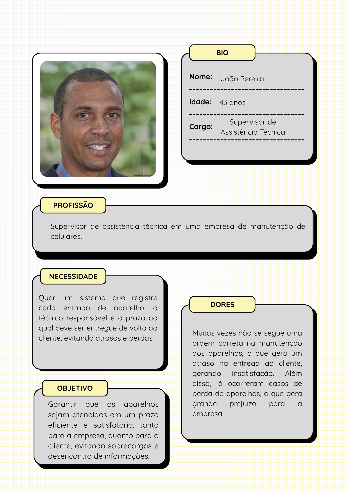
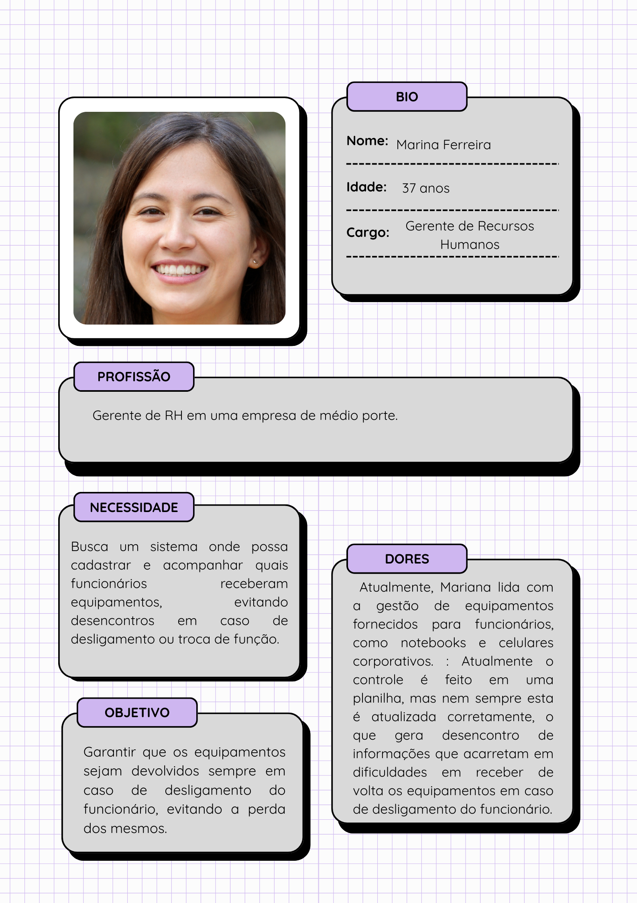
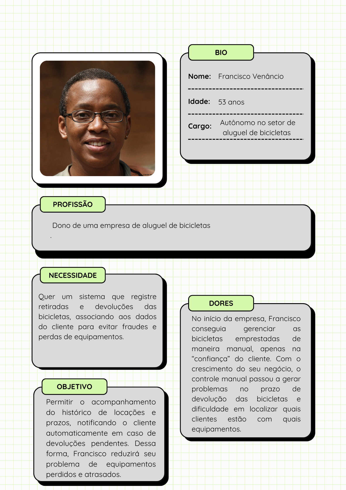
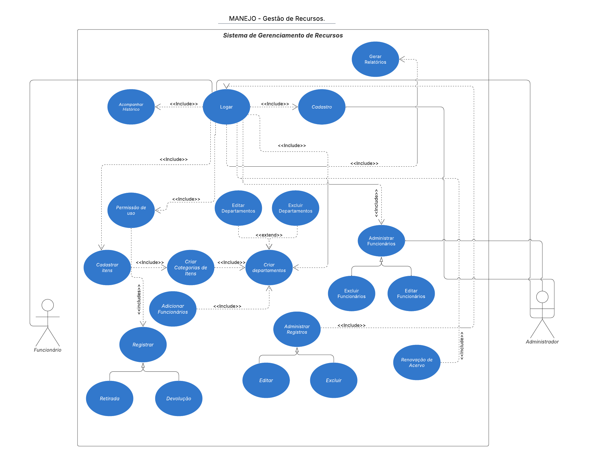

# Especificação do projeto

Pré-requisitos: <a href="01-Contexto.md"> Documentação de contexto</a>

## Personas

 <h4> Persona 1: João Mendes – Gerente de Produção </h4>
  <ul>
  <li>Idade: 42 anos</li>
  <li>Profissão: Gerente de Produção em uma indústria de equipamentos eletrônicos</li>
  <li>Dores: Tem dificuldades em acompanhar quais funcionários estão com quais ferramentas, pois tudo é controlado por planilhas e anotações manuais. A perda de equipamentos e o atraso na devolução geram prejuízos.</li>
  <li>Necessidade:Um sistema simples e automatizado que permita controlar as retiradas e devoluções de equipamentos de forma prática, com notificações e histórico de uso.</li>
  <li>Objetivo: Melhorar a gestão de recursos dentro da empresa, reduzindo perdas e tornando o controle mais eficiente.</li>
 </ul>

 
 
  
  
 

  <h4>Persona 2: Mariana Souza – Empreendedora de Biblioteca Comunitária</h4>
  <ul>
  <li>Idade: 35 anos</li>
  <li>Profissão: Proprietária de uma biblioteca comunitária que empresta livros físicos e digitais</li>
  <li>Dores: O controle dos empréstimos é feito em um caderno e algumas planilhas no computador, o que gera confusão e dificulta o acompanhamento das devoluções. Alguns usuários acabam ficando com os livros por muito tempo.</li>
  <li>Necessidade: Uma plataforma intuitiva onde possa registrar empréstimos e devoluções, com lembretes automáticos para os usuários.</li>
  <li>Objetivo: Garantir que os recursos (livros e e-books) sejam usados de forma eficiente e que os clientes tenham acesso facilitado a eles.</li>
 </ul>

  
  
   
  

  <h4>Persona 3: João Pereira – Supervisor de Assistência Técnica</h4>
   <ul>
  <li>Idade: 43 anos</li>
  <li>Profissão: Supervisor de assistência técnica em uma empresa de manutenção de celulares</li>
  <li>Dores: Muitas vezes não se segue uma ordem correta na manutenção dos aparelhos, o que gera um atraso na entrega ao cliente, gerando insatisfação. Além disso, já ocorreram casos de perda de aparelhos, o que gera grande prejuízo para a empresa.</li>
  <li>Necessidade: : Quer um sistema que registre cada entrada de aparelho, o técnico responsável e o prazo ao qual deve ser entregue de volta ao cliente, evitando atrasos e perdas.</li>
  <li>Objetivo: Garantir que os aparelhos sejam atendidos em um prazo eficiente e satisfatório, tanto para a empresa, quanto para o cliente, evitando sobrecargas e desencontro de informações.</li>
 </ul>

   
  

  <h4>Persona 4: Mariana Ferreira – Gerente de Recursos Humanos</h4>
   <ul>
  <li>Idade: 37 anos</li>
  <li>Profissão: Gerente de RH em uma empresa de médio porte</li>
  <li>Dores: Atualmente, Mariana lida com a gestão de equipamentos fornecidos para funcionários, como notebooks e celulares corporativos. : Atualmente o controle é feito em uma planilha, mas nem sempre esta é atualizada corretamente, o que gera desencontro de informações que acarretam em dificuldades em receber de volta os equipamentos em caso de desligamento do funcionário.</li>
  <li>Necessidade: : Busca um sistema onde possa cadastrar e acompanhar quais funcionários receberam equipamentos, evitando desencontros em caso de desligamento ou troca de função.</li>
  <li>Objetivo: Garantir que os equipamentos sejam devolvidos sempre em caso de desligamento do funcionário, evitando a perda dos mesmos.</li>
 </ul>

 

  
  

  <h4>Persona 5: Francisco Venâncio – Autônomo no setor de aluguel de bicicletas</h4>
   <ul>
  <li>Idade: 53 anos</li>
  <li>Profissão: : Dono de uma empresa de aluguel de bicicletas</li>
  <li>Dores: : No início da empresa, Francisco conseguia gerenciar as bicicletas emprestadas de maneira manual, apenas na “confiança” do cliente. Com o crescimento do seu negócio, o controle manual passou a gerar problemas no prazo de devolução das bicicletas e dificuldade em localizar quais clientes estão com quais equipamentos.</li>
  <li>Necessidade: : Quer um sistema que registre retiradas e devoluções das bicicletas, associando aos dados do cliente para evitar fraudes e perdas de equipamentos.</li>
  <li>Objetivo: Permitir o acompanhamento do histórico de locações e prazos, notificando o cliente automaticamente em caso de devoluções pendentes. Dessa forma, Francisco reduzirá seu problema de equipamentos perdidos e atrasados.</li>
 </ul>

 

</h4>

## Histórias de usuários

Com base na análise das personas, foram identificadas as seguintes histórias de usuários:

|EU COMO... `PERSONA`| QUERO/PRECISO ... `FUNCIONALIDADE` |PARA ... `MOTIVO/VALOR`                 |
|--------------------|------------------------------------|----------------------------------------|
|Usuário do sistema  | Registrar a retirada e devolução de equipamentos           | Garantir que as ferramentas estejam disponíveis e evitar perdas  |
|Usuário do sistema  | Cadastrar itens no sistema           | Facilitar o controle de empréstimos e disponibilidade               |
|Usuário do sistema  | Acompanhar histórico de empréstimos de cada usuário           | Identificar padrões de uso e tomar decisões sobre renovação de acervo      |
|Usuário do sistema  | Visualizar um histórico de movimentações de cada equipamento.        | Acompanhar trocas, devoluções e manutenções realizadas em cada equipamento.  |
|Usuário do sistema  | Registrar os dados de retirada e devolução no sistema.         | Garantir um maior controle de equipamentos disponíveis e já alocados.  |
|Usuário do sistema  | Pesquisar equipamentos disponíveis por categoria ou status.    | Encontrar rapidamente o que preciso para o trabalho.  |
|Usuário do sistema  | Solicitar empréstimo de equipamento diretamente pelo sistema.         | Simplificar o processo e agilizar a aprovação.  |
|Usuário do sistema  | Atualizar meus dados pessoais e de contato no perfil do sistema.         | Manter as informações corretas para comunicação eficiente.  |
|Administrador       | Criar categorias para diferentes tipos de recursos                | Facilitar a organização e busca dentro do sistema |
|Administrador       | Editar ou excluir registros de equipamentos e recursos                | Manter o banco de dados atualizado e organizado |
|Administrador       | Gerenciar permissões de usuários               | Controlar quem pode cadastrar, editar e visualizar dados no sistema |
|Administrador       | Cadastrar, remover e editar técnicos no sistema              | Garantir que só estejam no sistema técnicos atualmente credenciados pela empresa. |
|Administrador       | Definir regras para empréstimo e devolução de equipamentos, incluindo prazos.             | Garantir a padronização do processo e evitar falhas humanas. |
|Administrador       | Gerar relatórios de cada equipamento emprestado, quem está com o equipamento atualmente, etc.               | Garantir o controle das locações. |

## Requisitos

### Requisitos funcionais

| ID    | Descrição do Requisito  | Prioridade |
|------|-----------------------------------------|----|
| RF-001 | A empresa deve criar um usuário e senha. | ALTA | 
| RF-002 | A empresa deve conseguir fazer login com seu usuário e senha. | ALTA |
| RF-003 | A empresa deve conseguir recuperar seus dados de login. | MÉDIA |
| RF-004 | A empresa deve conseguir criar departamentos de empréstimos. | ALTA |
| RF-005 |A empresa deve conseguir realizar a adição de produtos (ferramentas) com código único que serão emprestados, assim como a quantidade específica e localização de cada objeto. | ALTA |
| RF-006 | Cada departamento criado deve permitir a adição de clientes (sejam internos ou externos), com código único, nome e CPF. | ALTA |
| RF-007 | O sistema deverá ter uma tela para realizar empréstimos, onde será necessário adicionar o código do funcionario, o código da ferramanta, a quantidade de ferramentas e a data do empréstimo, assim como a data para devolução. | ALTA |
| RF-008 | O sistema deverá registrar o código, a quantidade de ferramentas emprestadas, as ferramentas, a data do empréstimo e a data de devolução. | MÉDIA |
| RF-009 | O sistema deverá aceitar a devolução de emprestimos | ALTA |
| RF-010 | O sistema deverá mostrar a lista de emprestimos. | ALTA |
| RF-011 | A empresa deverá conseguir editar o nome dos departamentos e dos objetos. | MÉDIA |
| RF-012 | A empresa deverá conseguir excluir departamentos e objetos. | MÉDIA |
| RF-013 | A empresa deverá conseguir apagar clientes. | MÉDIA |
| RF-014 | A empresa deverá conseguir editar o nome e o código do cliente. | MÉDIA |
| RF-015 | O sistema deverá permitir a exibição da lista de um determinado setor com produtos emprestados, mostrando o cliente, o produto, a data e a hora do empréstimo. | MÉDIA |
| RF-016 | O sistema poderá bloquear temporária ou permanentemente (a menos que seja revogado) um cliente de realizar empréstimos de um determinado setor/objeto. | BAIXA |
| RF-017 | O sistema deverá permitir a revogação do bloqueio de um cliente. | BAIXA |
| RF-018 | O sistema deverá permitir a criação de lembretes de tarefas a serem feitas. | MÉDIA |

### Requisitos não funcionais

|ID     | Descrição do Requisito  |Prioridade |
|-------|-------------------------|----|
|RNF-001| O sistema deve processar as requisições do usuário em no máximo 3 segundos | BAIXA | 
|RNF-002| O sistema deve estar disponível 99% do tempo, garantindo acesso contínuo aos usuários, salvo períodos de manutenção planejada |  MÉDIA | 
|RNF-003|O sistema deve ser acessível via navegador web em dispositivos desktop e mobile, garantindo compatibilidade com os principais navegadores (Chrome, Edge, Firefox, Safari) | MÉDIA | 
|RNF-004| O sistema deve ser capaz de suportar um crescimento de até 500 usuários simultâneos sem degradação de desempenho |  BAIXA | 
|RNF-005| O sistema deve realizar backups automáticos diários dos dados para evitar perda de informações em caso de falhas | BAIXA | 
|RNF-006| O sistema deve seguir normas de proteção de dados e LGPD (Lei Geral de Proteção de Dados) no Brasil, garantindo a privacidade e segurança das informações dos clientes |  ALTA | 
|RNF-007| As páginas e funcionalidades do sistema devem carregar em no máximo 3 segundos | BAIXA | 
|RNF-008| O sistema deve contar com mecanismos para recuperação de falhas, evitando perda de dados em caso de queda de servidor ou erros inesperados |  ALTA | 
|RNF-009| O sistema deve permitir integração com outras plataformas de gestão empresarial ERP | BAIXA | 

## Restrições

|ID| Restrição                                             |
|--|-------------------------------------------------------|
|001| O projeto deverá ser entregue até o final do semestre |
|002| O custo total do projeto não deve exceder o orçamento definido pelo grupo |
|003| O sistema irá ser desenvolvido utilizando tecnológias previamente decididas entre a equipe|
|004| O projeto deverá ser acessado exclusivamente por navegador web|
|005| O projeto irá ser desenvolvido seguindo os Requisitos Funcionais e Não funcionais|
|006| O sistema deverá ser implementado em ambiente de teste |
|007| As atualizações dos projetos deveram ser lançados apenas com breve autorização do scrum Master |
|008| Qualquer modificação de projeto, que foge das documentações iniciais deveram ser discutidas junto a todos os membros do projeto, onde será mapiado novos prazos e impactos no projeto.|
|009| O tempo de resposta do sistema deverá ser viável, não excedendo 2 segundos |

## Diagrama de casos de uso

 

