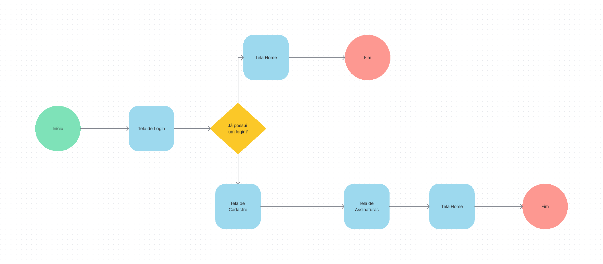
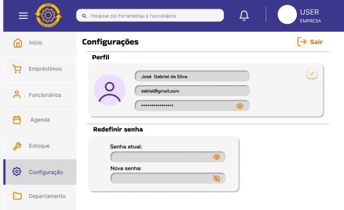

# Projeto de interface

Pré-requisitos: <a href="02-Especificacao.md"> Especificação do projeto</a>

Visão geral da interação do usuário pelas telas do sistema e protótipo interativo das telas com as funcionalidades que fazem parte do sistema (wireframes).

 Apresente as principais interfaces da plataforma. Discuta como ela foi elaborada de forma a atender os requisitos funcionais, não funcionais e histórias de usuário abordados na <a href="02-Especificacao.md"> Especificação do projeto</a>.

 ## User flow
 
 O fluxo de navegação da aplicação Manejo GR foi cuidadosamente planejado para garantir uma experiência intuitiva e funcional ao usuário, desde o acesso inicial até a gestão completa dos recursos internos da empresa. A estrutura de telas cobre todo o ciclo de uso da plataforma, iniciando com login, cadastro e assinatura, e seguindo por seções como gestão de funcionários, controle de estoque, agendamentos, departamentos, configurações e relatórios. Cada interface foi desenhada para facilitar a execução das tarefas com agilidade e clareza, refletindo o objetivo central da aplicação: simplificar a gestão de materiais e recursos para empresas que buscam modernizar seus processos operacionais.
 

### Diagrama de fluxo

O diagrama de fluxo a seguir ilustra o processo detalhado de autenticação do usuário em uma tela de login. Ele descreve as etapas sequenciais desde a entrada das credenciais pelo usuário até a validação dessas informações e a consequente autorização para acesso ao sistema. Este fluxo inclui as verificações de erros, como dados incorretos ou campos vazios, além das ações tomadas em caso de sucesso ou falha no login, garantindo uma compreensão clara do funcionamento e das possíveis interações dentro dessa funcionalidade.

## Wireframes

Os wireframes do projeto Manejo apresentam a estrutura visual e a organização das principais telas do sistema, proporcionando uma visão clara da navegação e das funcionalidades disponíveis. O projeto contempla telas essenciais como a Home, Login e Cadastro para acesso e registro dos usuários, além de telas específicas para Empréstimo, Funcionário, Estoque, Agenda, Configuração e Departamento. Cada wireframe foi elaborado para facilitar a interação do usuário, otimizando o fluxo de trabalho e garantindo uma experiência intuitiva e eficiente dentro do sistema.

 

## Interface do sistema

### Tela principal do sistema

Na tela principal, o usuário terá acesso a menus rápidos com links diretos para todas as outras funcionalidades da aplicação, além de possuir widgets que informam a quantidade de funcionários ativos na empresa, o número de ferramentas presentes no estoque e um mural de lembretes.

###  Telas de Emprestimo

Na tela inicial de Empréstimo, o usuário tem acesso aos menus de edição de departamento, empréstimo de material e bloqueio de empréstimo. Alémde uma seção dedicada a um aviso de empréstimos em atraso.

Na tela de Listar Empréstimos, o usuário consegue ver e filtrar todos os empréstimos que estão ativos, além de conseguir devolvê-los.

### Telas de Compra de Ferramentas

Após a compra de ferramentas, o usuário pode adicioná-las no estoque, infromando dados relevantes para a organização, como por exemplo a quantidade de determinada ferramenta, seu nome e código.

O usuário consegue ver e editar todas as ferramentas que estão no estoque, assim como ver o histórico de uso de cada uma.

